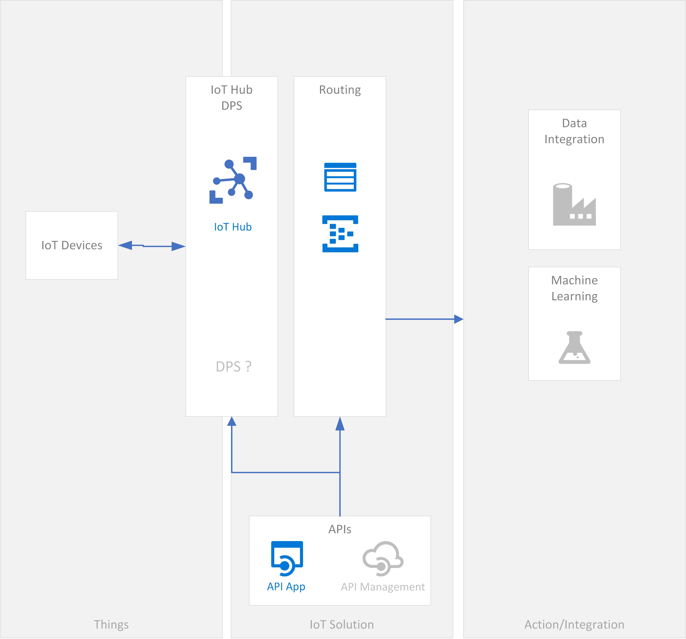

# Covid data collector

COVID pandemic is world wide and the impact in all our lives is being huge.
The sooner we stop it (or find medics), the better for all of us.
The proposed solution is only a very small contribution from the IT world, in order to help the scientific community in their very hard labor.

## Purpose
The purpose of the project is to build a simple solution allowing to collect and gather data related to covid-19 from all around the world.

Data will be related to symptoms and how people live the disease.

The only target of all this is to provide to the scientific community as much data as possible about what people has been experiencing.

> IMPORTANT
> No personal data will be required and all the data will be anonymized.
> There is no interest on tracking an individual person nor having that possibility at any given time. Privacy above all.

## Type of collected data
The type of data will be determined with doctors and/or scientists.
At first sight, we could imagine data like:
 - symptoms
 - phases
 - dates

As mentioned earlier, data will be anonymized to preserve privacy.
This needs to be underlined as many times as required and all the developments have to take care of this.

## Format and structure of data
The format of data will be JSON.

Regarding its structure, ideally, a standard data schema would be nice (ex: FHIR related flows?).
That said, not sure there is one for this kind of purposes. Also, we need to be very fast in all this implementation to gather pertinent data.

So, let's define our schema, trying to gather the required data.

Once stored, other processes can take in charge mapping or format changing tasks.

## Solution
The approach in mind is to use the very extense market of cell phones all around the world. They could behave as IoT devices through a mobile application.
That application, in turn, will host IoT features and behave as an IoT device.

### Why not to use a conventional solution?
A more "classic" solution would be to develop a mobile application and make it push the data through APIs, queues or message brokers (for instance, Azure Event Hub or Kafka). This would work properly as for as concerned the purpose of gathering data.

However, the solution will miss many interesting and useful IoT features. It would be unfortunate to get rid of all that having the possibility to use them.

### Smart IoT
The creative aspect of the proposed solution resides on the fact that there is no IoT device. This role will be played by an application hosted in a mobile application (phone application).

### Flows
#### D2C
Data from the application to a given IoT Hub.
Once data in the IoT solution, it can follow different routes depending on the requirements we agree upon.

#### C2D
The type of communication between the cloud solution and the IoT client application will be:
 - Twins (Desired, Reported Properties and Tags)
 - Messages
 - Commands

This may allow to implemente use cases like:
 - configuration changes
 - request data
 - request application reinitializations
 - IoT device application updates (not mobile application updates)

### Storage
Data will be stored as raw data in cold storages.

Once the data is at least, at that level of persistence, we can consider other solutions and data flows. For instance, the used storages could feed other data lakes, analytics or any other flow meant to process (analytics) and extract value.

## Global architecture

### IoT device application (client side)
Mobile applications are mostly divided in iOS and Android applications.
So, let's focus on that.

Xamarin or similar solutions allowing to capitalize the development could be important to save time in the overall development process (development, factorization, testing, etc).
Among the people who feel on this, keep in mind the purpose and I am sure wise choices will be made.

### IoT Solution (cloud side)
Regarding the cloud IoT solution, there are two approaches:
 - SaaS, (ex: IoT Central) very fast to implement but with limitations in terms of features or evolutions;
 - PaaS, with more possibilities but will probably take longuer to be implemented.

I have to admit that chosing SaaS approach with IoT Central was pretty tempting. However, being an Open Source project and not knowing how the project will evolve, having a more "agile" or flexible approach is maybe better, even though it requires an initial bigger effort.

This would be the overall architecture of the current version of the solution:

# Contributions
Feel free to take part in this.
In order to be efficient, we need to organize the work very wisely and precisely.
Actions will start quite soon because the context requires so. That said, don't be shy and feel free to join us whenever you feel you can.

# Conditions
The purpose of the solution is simple and clear: provide data of quality to the scientist community.
Most important points:
 - collect and gather data
 - collect USEFUL data coming directly from people
 - find a solution not intrusive but globaly expanded
 - anonymize ALL the collected data (PRIVACY IS MANDATORY)

> There is no business or lucrative purpose in all this.

All contributions are welcomed.
Not constructive or unethical behaviors have no room in this initiative.
This pandemic is world wide.
Let's just help each other as we can.

## Conditions of data use
The only purpose of this raw data is to help scientists in their labor of analyzing and understanding the impacts of Covid-19.
No other use is allowed.
